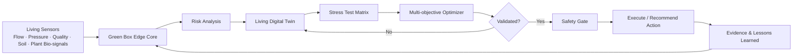

# AquaGuardian AI Architecture

## Design principles

1. Edge-first and offline-capable
2. No automatic action without simulation and validation
3. Fail-safe fallback under communication loss
4. Evidence attached to every decision
5. Human approval required for real deployments
